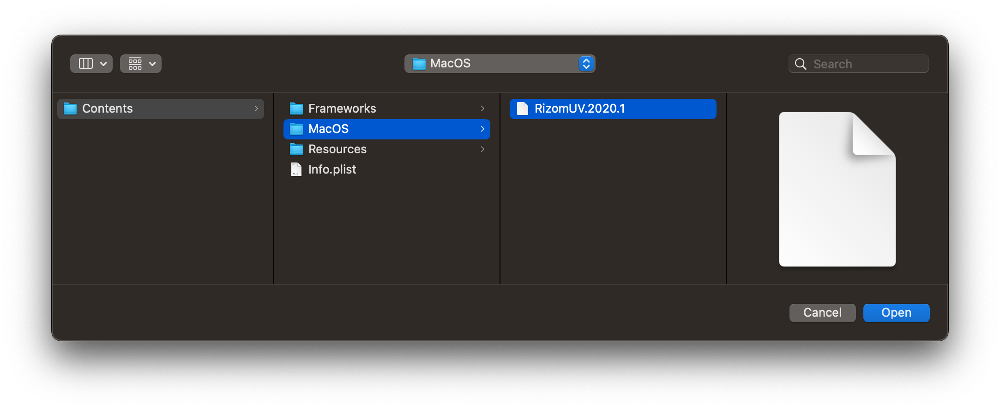

# RizomUV Bridge for Cinema4D R23

### Installation:

Unpack plugin in your Plugins directory.
Start Cinema4D and open Options window: Plugins > RizomUV Exporter > Options
Specify the work path of the rizomuv.exe ( default location is: C:\Program Files\Rizom Lab\[RizomUV] )

If you are updating the plugin, please, delete the settings.json ( the previous version's configuration file ) file from C:\Users\[USER]\AppData\Roaming\MAXON\Cinema 4D R1X_XXX\prefs\rizomUV folder.

### For macOS Users

This fork has added support for Cinema4D for macOS (tested in R24, should still be working in R23).

#### FAQ

**Q: I have set the RizomUV path in the Options window, but I got the "RizomUV not found" error.**

A: In the Options window, you should choose the path of the executable (e.g. `RizomUV.2020.1.app/Contents/MacOS/RizomUV.2020.1`) instead of the application package (`RizomUV.2020.1.app`).

You can follow these steps if you are not clear what that means:

1. Install RizomUV Bridge like any other Cinema4D Plugins
2. Start Cinema4D and find the "Options" menu item under "RizomUV Bridge" from the Extensions menu
3. Click on "..." button of the "RizomUV Path" option, keep the file choosing window open
4. Open a new Finder window, and go to "Applications" folder, then locate your RizomUV application (e.g. `RizomUV.2020.1.app`)
5. Right click on the application and select "Show Package Contents"
6. Go into "Contents" folder, then "MacOS" folder, there should be a file with the name like "RizomUV.2020.1" (depending on which version you have, the number might vary)
7. Drag this file, then drop it to the file choosing window from step 3
8. The file choosing window should now show this executable file
9. Click "Open", then "Save", and the error should be gone

Example of the executable:

